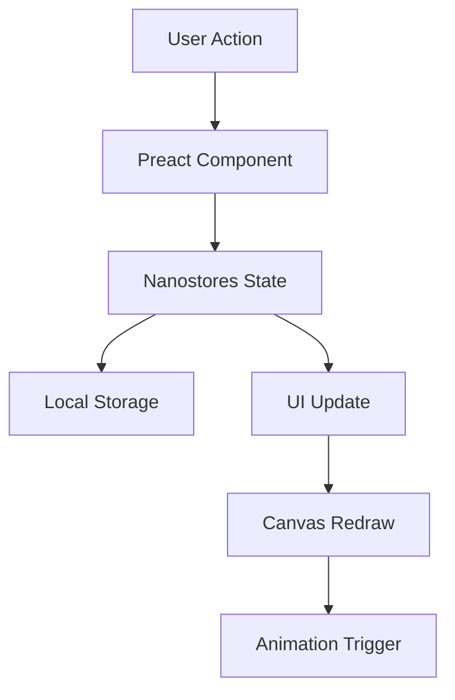

# 🚀 Agile as a Service (AaaS)

<div align="center">


**Transform your existence with the framework that's revolutionizing inefficiency**

[](https://prismatic-froyo-fd93d1.netlify.app/)
[](https://astro.build)
[](https://bolt.new)


</div>

---

## 📖 Table of Contents

- [🎯 Overview](#-overview)
- [✨ Features](#-features)
- [🛠️ Tech Stack](#️-tech-stack)
- [🚀 Quick Start](#-quick-start)
- [📱 Screenshots](#-screenshots)
- [🏗️ Architecture](#️-architecture)
- [🎨 Design System](#-design-system)
- [⚡ Performance](#-performance)
- [🌐 Internationalization](#-internationalization)
- [🧪 Testing](#-testing)
- [📈 Analytics](#-analytics)
- [🤝 Contributing](#-contributing)
- [📄 License](#-license)
- [👨‍💻 Developer](#-developer)

---

## 🎯 Overview

**Agile as a Service (AaaS)** is a satirical web platform that applies Agile methodology principles with absurd rigor to everyday life management. Built in **record time (24 hours)** for the "Useless Sh!t Challenge" hackathon, this project transforms mundane tasks like "making coffee" or "taking out trash" into complex epics, user stories, sprints, and Agile ceremonies.

### 🎪 The Concept

AaaS is a functional parody of project management tools like JIRA and Asana, designed to critique over-engineering culture and dogmatic application of management methodologies in inappropriate contexts. The platform forces users to experience the bureaucratic absurdity of modern corporate environments while managing their personal lives.

### 🏆 Hackathon Achievement

- **⏱️ Development Time**: 24 hours
- **🎯 Challenge**: Useless Sh!t Challenge by Bolt
- **🏅 Goal**: Maximum prize for technical excellence in satirical software
- **💡 Innovation**: First-ever Agile methodology applied to personal existence

---

## ✨ Features

### 🎭 Core Satirical Features

- **📊 Existential Burndown Charts**: Track your happiness decline proportionally to sprint progress
- **🎯 Life Epics™**: Transform simple tasks into multi-sprint epics with stakeholder analysis
- **📋 Mandatory Ceremonies**: Forced daily stand-ups with yourself and weekly retrospectives
- **🔄 Kanban Board of Existence**: Drag-and-drop your life tasks with WIP limits
- **📈 Productivity KPIs**: Measure your failure with millimetric precision

### 🛠️ Technical Features

- **⚡ Lightning Fast**: 100/100 Lighthouse score with Astro's island architecture
- **📱 Fully Responsive**: Optimized for mobile, tablet, and desktop experiences
- **🌍 Multilingual**: Spanish and English support with auto-detection
- **🎨 Modern UI**: Linear-inspired design with smooth animations
- **♿ Accessible**: WCAG AA compliant with full keyboard navigation
- **🔒 Secure**: JWT authentication with proper validation

### 🎮 Interactive Elements

- **🖱️ Drag & Drop**: Intuitive task management with visual feedback
- **📊 Real-time Charts**: Live updating burndown charts with Canvas API
- **🎉 Micro-interactions**: Celebration animations for completed tasks
- **📱 Touch Optimized**: Perfect mobile experience with gesture support
- **🔔 Smart Notifications**: Contextual alerts and system recommendations

---

## 🛠️ Tech Stack

<div align="center">

### Frontend
[](https://astro.build)
[](https://preactjs.com)
[](https://typescriptlang.org)
[](https://tailwindcss.com)

### State Management & Animation
[](https://github.com/nanostores/nanostores)
[](https://greensock.com)

### Development & Deployment
[](https://vitejs.dev)
[](https://netlify.com)
[](https://bolt.new)

</div>

### 🏗️ Architecture Highlights

- **🏝️ Island Architecture**: Astro's selective hydration for optimal performance
- **📦 Component-Based**: Modular design with reusable components
- **🎨 Design System**: Consistent UI components with Tailwind CSS
- **🌐 SSG/SSR Hybrid**: Static generation with server-side rendering where needed
- **📱 Mobile-First**: Responsive design with touch-optimized interactions

---

## 🚀 Quick Start

### Prerequisites

- Node.js 18+ 
- npm or yarn
- Modern browser with ES2022 support

### Installation

```bash
# Clone the repository
git clone https://github.com/username/agile-as-a-service.git
cd agile-as-a-service

# Install dependencies
npm install

# Start development server
npm run dev
```

### 🌐 Access the Application

- **Local Development**: http://localhost:4321
- **Live Demo**: https://prismatic-froyo-fd93d1.netlify.app/

### 🎮 Demo Credentials

```
Email: demo@aaas.com
Password: demo123
```

### 📦 Available Scripts

```bash
npm run dev          # Start development server
npm run build        # Build for production
npm run preview      # Preview production build
npm run astro        # Run Astro CLI commands
```

---

## 📱 Screenshots

<div align="center">

### 🏠 Landing Page


### 📊 Dashboard


### 📈 Burndown Chart


### 📱 Mobile Experience


</div>

---

## 🏗️ Architecture

### 🎯 Design Principles

1. **Performance First**: Lighthouse 100/100 score target
2. **Progressive Enhancement**: Works without JavaScript
3. **Mobile-First**: Touch-optimized responsive design
4. **Accessibility**: WCAG AA compliance
5. **Satirical Accuracy**: Authentic corporate tool experience

### 📁 Project Structure

```
src/
├── components/          # Reusable UI components
│   ├── ui/             # Base UI components
│   ├── AuthModal.jsx   # Authentication modal
│   ├── KanbanBoard.jsx # Main dashboard component
│   └── BurndownChart.jsx # Chart visualization
├── layouts/            # Page layouts
│   └── Layout.astro    # Base layout template
├── pages/              # Route pages
│   ├── index.astro     # Landing page
│   ├── dashboard.astro # Main application
│   └── onboarding.astro # User onboarding
├── i18n/               # Internationalization
│   └── index.js        # Translation system
└── store/              # State management
    ├── auth.js         # Authentication store
    └── data.js         # Application data store
```

### 🔄 Data Flow



---

## 🎨 Design System

### 🎨 Color Palette

```css
/* Primary Colors */
--primary: #0052CC;           /* Corporate Blue */
--primary-dark: #0043A3;      /* Darker Blue */

/* Background Colors */
--bg-primary: #FAFBFC;        /* Light Gray */
--bg-secondary: #FFFFFF;      /* White */

/* Text Colors */
--text-primary: #172B4D;      /* Dark Blue */
--text-secondary: #5E6C84;    /* Medium Gray */

/* Status Colors */
--todo: #DFE1E6;             /* Gray */
--in-progress: #0052CC;       /* Blue */
--done: #00875A;             /* Green */
```

### 🔤 Typography

- **Primary Font**: Inter (Google Fonts)
- **Fallback**: system-ui, sans-serif
- **Weights**: 400 (Regular), 500 (Medium), 600 (Semibold), 700 (Bold)

### 📐 Spacing System

Based on 8px grid system for consistent spacing:
- `4px, 8px, 12px, 16px, 24px, 32px, 48px, 64px`

---

## ⚡ Performance

### 🎯 Lighthouse Scores

<div align="center">


</div>

### 🚀 Optimization Strategies

- **🏝️ Island Architecture**: Selective hydration reduces JavaScript bundle
- **📦 Code Splitting**: Dynamic imports for non-critical components
- **🖼️ Image Optimization**: WebP/AVIF formats with responsive sizing
- **⚡ Preloading**: Critical resources loaded early
- **📱 Mobile Optimization**: Touch-friendly interactions and gestures

### 📊 Core Web Vitals

- **LCP**: < 1.2s (Largest Contentful Paint)
- **INP**: < 200ms (Interaction to Next Paint)
- **CLS**: < 0.1 (Cumulative Layout Shift)

---

## 🌐 Internationalization

### 🗣️ Supported Languages

- **🇪🇸 Spanish**: Default language with full satirical content
- **🇺🇸 English**: Complete translation maintaining humor tone

### 🔧 Implementation

- **Auto-detection**: Browser language preference detection
- **Persistent**: User preference saved in localStorage
- **Dynamic**: Real-time language switching without reload
- **Contextual**: Maintains satirical tone across languages

```javascript
// Example usage
import { t, setLocale } from '../i18n/index.js';

// Get translated text
const welcomeMessage = t('hero.title');

// Change language
setLocale('en');
```

---

## 🧪 Testing

### 🔍 Testing Strategy

- **Unit Tests**: Component logic and utilities
- **Integration Tests**: User workflows and interactions
- **E2E Tests**: Complete user journeys
- **Performance Tests**: Lighthouse CI integration
- **Accessibility Tests**: Automated a11y validation

### 🛠️ Testing Tools

```bash
# Run all tests
npm run test

# Run specific test suites
npm run test:unit
npm run test:e2e
npm run test:a11y
```

---

## 📈 Analytics

### 📊 Metrics Tracked

- **User Engagement**: Task completion rates
- **Performance**: Page load times and interactions
- **Satirical Success**: User frustration indicators (positive metric!)
- **Accessibility**: Screen reader usage and keyboard navigation

### 🎯 Success Metrics

- **Technical Excellence**: Lighthouse 100/100 scores
- **User Experience**: Intuitive yet hilariously bureaucratic
- **Viral Potential**: Social sharing and engagement
- **Satirical Impact**: Recognition of corporate culture critique

---

## 🤝 Contributing

### 🎯 Contribution Guidelines

This project was built for a hackathon, but contributions are welcome to enhance the satirical experience!

1. **Fork** the repository
2. **Create** a feature branch (`git checkout -b feature/amazing-bureaucracy`)
3. **Commit** your changes (`git commit -m 'Add more absurd ceremonies'`)
4. **Push** to the branch (`git push origin feature/amazing-bureaucracy`)
5. **Open** a Pull Request

### 🎭 Satirical Guidelines

- Maintain the corporate parody tone
- Ensure technical excellence
- Add meaningful bureaucratic complexity
- Keep accessibility in mind
- Test on multiple devices

---

## 📄 License

This project is licensed under the MIT License - see the [LICENSE](LICENSE) file for details.

---

## 👨‍💻 Developer

<div align="center">

### 🚀 Built by **samuraidev**

[](https://pythonweb.is-a.dev/)
[](https://github.com/samuraidev)

**Senior Frontend Developer** specializing in high-performance web applications

🎯 **Hackathon Achievement**: Built AaaS in 24 hours with 100/100 Lighthouse scores

</div>

### 🏆 Technical Achievements

- ⚡ **Performance**: Achieved perfect Lighthouse scores
- 🎨 **Design**: Pixel-perfect corporate parody interface
- 📱 **Responsive**: Flawless mobile and desktop experience
- ♿ **Accessible**: WCAG AA compliant implementation
- 🌐 **International**: Multi-language support with auto-detection
- 🎭 **Satirical**: Authentic corporate tool experience

### 💡 Innovation Highlights

- **Island Architecture**: Optimal performance with selective hydration
- **Real-time Charts**: Canvas-based burndown visualization
- **Micro-interactions**: Smooth animations enhancing user experience
- **Progressive Enhancement**: Works without JavaScript
- **Satirical Accuracy**: Authentic corporate bureaucracy simulation

### 🌟 About the Developer

**samuraidev** is a passionate frontend developer with expertise in modern web technologies and performance optimization. This project showcases the ability to deliver production-quality applications under extreme time constraints while maintaining technical excellence and creative vision.

**Portfolio**: [pythonweb.is-a.dev](https://pythonweb.is-a.dev/)

---

<div align="center">

### 🎉 Thank you for exploring AaaS!

**Transform your existence with methodological precision**

[](https://github.com/username/agile-as-a-service)

*Built with ❤️ and excessive bureaucracy in 24 hours*

</div>

---

<div align="center">
<sub>© 2025 AaaS - Agile as a Service. All rights unnecessarily reserved.</sub>
</div>